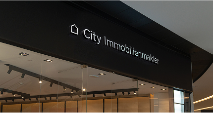

# City Immobilienmakler Hannover


Willkommen bei **City Immobilienmakler Hannover** – Ihrer ersten Adresse für Immobilien in Hannover und Umgebung.

---

## 🚀 Projektübersicht

Diese Website präsentiert die Leistungen, Werte und das Team von City Immobilienmakler Hannover. Sie ist optimiert für mobile Endgeräte und bietet ein modernes, visuelles Erlebnis mit hochwertigen Bildern und klarer Struktur.

---

## 📸 Impressionen

<!--  -->



---

## 🏆 Auszeichnungen


---

## 📂 Projektstruktur

```
index.html
assets/
  icons/
    logo.png
    calender.png
    lock.png
    users.png
    insta.png
    youtube.png
    tick.png
    stars.svg
    hand.svg
    favicon.ico
  images/
    hero_3.jpg
    city-immobili.png
    team.png
    element-1@4x-1.png
    werkenntdenbesten@2x-1.png
    marktwert-makler-1.png
    ...
.vercel/
  project.json
```

---

## 🛠️ Technologien

- **HTML5**
- **Tailwind CSS**
- **Responsive Design**
- **Vercel** (Deployment)

---

## 📞 Kontakt

- **Telefon:** 0511 13 22 11 00
- **E-Mail:** info@city-immobilienmakler.de
- **Adresse:** Kurt-Schumacher-Straße 25, 30159 Hannover

---

## 💡 Hinweise

- Alle Bilder und Icons befinden sich im `assets`-Ordner.
- Die Seite ist für mobile Geräte optimiert.
- Für ein optimales Erlebnis bitte im Browser öffnen.

---

## 🏙️ Vorschau


---

© 2025 City Immobilienmakler
